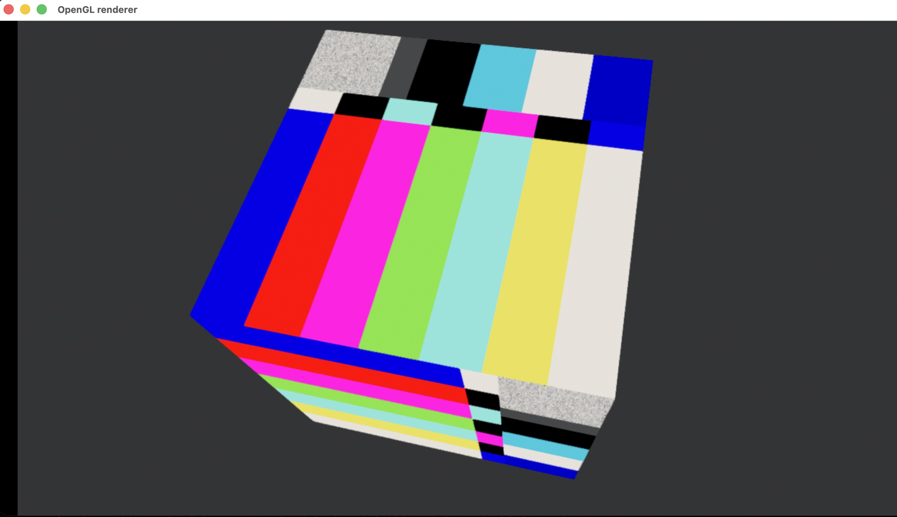

# FLUX Protocol

**Fabric for Low-latency Unified eXchange** — v0.6.3, 2026-04-05  
Open protocol + GStreamer plugin suite for professional low-latency media transport over QUIC and UDP multicast.

**Platform:** macOS (Apple Silicon / x86_64, primary)  
**License:** BSD-3-Clause — Copyright 2026 Jesus Luque  
**Spec:** [spec/FLUX_Protocol_Spec_v0_6_3_EN.md](spec/FLUX_Protocol_Spec_v0_6_3_EN.md)  
**Homepage:** [jesusluque.github.io/flux](https://jesusluque.github.io/flux/)

---

## What is FLUX?

FLUX is a transport-layer protocol designed for sub-millisecond glass-to-glass latency in broadcast and real-time production environments. It runs over two complementary profiles:

| Profile | Transport | Use case |
|---------|-----------|----------|
| **FLUX/QUIC** | QUIC Datagram (RFC 9221), TLS 1.3 | Unicast; adaptive bitrate, upstream control |
| **FLUX/M** | UDP SSM multicast + RaptorQ FEC | One-to-many; scalable, no per-receiver signalling |

Beyond basic transport, FLUX integrates seven subsystems as first-class protocol citizens: adaptive bandwidth control (CDBC), multi-stream synchronisation (MSS), service discovery (FLUX-D), bidirectional tally (FLUX-T), automatic monitor stream (FLUX-M), in-stream binary embedding (FLUX-E), and upstream device control (FLUX-C).

---

## Repository Layout

```
flux/
├── spec/
│   └── FLUX_Protocol_Spec_v0_6_3_EN.md   Protocol specification
├── tools/
│   ├── gstreamer/                         Rust workspace — GStreamer plugins
│   │   ├── flux-framing/                  Wire-format library (no GStreamer dep)
│   │   ├── gst-fluxframer/                Server-side FLUX packetiser
│   │   ├── gst-fluxdeframer/              Client-side FLUX depacketiser
│   │   ├── gst-fluxsink/                  QUIC sender (BaseSink, quinn)
│   │   ├── gst-fluxsrc/                   QUIC receiver (PushSrc, quinn)
│   │   ├── gst-fluxdemux/                 Frame type router (dynamic pads)
│   │   ├── gst-fluxcdbc/                  CDBC feedback observer
│   │   └── gst-fluxsync/                  MSS sync barrier
│   └── filament/
│       └── gst-fluxvideotex/              C/C++ GStreamer element — Filament renderer
├── poc001/                                Unicast H.265 + CDBC + FLUX-C
├── poc002/                                Four-stream mosaic + MSS
├── poc003/                                fluxvideotex live video texture
└── docs/                                  GitHub Pages site
```

---

## Prerequisites

**macOS (primary platform)**

```bash
# Rust
curl --proto '=https' --tlsv1.2 -sSf https://sh.rustup.rs | sh

# GStreamer (all three PoCs need the full framework)
brew install gstreamer gst-plugins-base gst-plugins-good gst-plugins-bad

# poc003 only — Filament renderer
brew install cmake ninja
```

GStreamer 1.22 or later is required. The macOS VideoToolbox codecs (`vtenc_h265`, `vtdec_hw`) are used for hardware H.265 encode/decode; they are included in `gst-plugins-bad` from Homebrew.

---

## Quick Start

### poc001 — Single-stream unicast (H.265 + CDBC + FLUX-C)

```bash
cd tools/gstreamer && cargo build --release && cd ../..

# Terminal 1 — server
cd poc001 && cargo run --bin server --release

# Terminal 2 — client
cd poc001 && cargo run --bin client --release
```

**Client keyboard controls**

| Key | Action |
|-----|--------|
| `Space` | Pause / resume |
| `T` | Cycle `videotestsrc` test pattern on server (FLUX-C) |
| `P` | Send PTZ preset to server (FLUX-C) |
| `A` | Toggle audio mute on channel 0 (FLUX-C) |
| `R` | Request routing info (FLUX-C) |
| `L` / `l` | NetSim loss +5 % / −5 % |
| `Y` / `y` | NetSim delay +20 ms / −20 ms |
| `B` / `b` | NetSim bandwidth cap +/−1 000 kbps |
| `Q` | Quit |

### poc002 — Four-stream mosaic (MSS)

```bash
cd tools/gstreamer && cargo build --release && cd ../..

# Terminal 1 — 4 server streams on ports 7400–7403
cd poc002 && cargo run --bin multi-server --release

# Terminal 2 — mosaic client (2×2 compositor)
cd poc002 && cargo run --bin mosaic-client --release
```

Each tile carries a `clockoverlay` showing wall-clock time to centisecond precision. A well-synchronised mosaic shows the **same** centisecond digit on all four tiles simultaneously. Use `+` / `-` on the server to inject per-stream delay and watch the MSS barrier compensate.

**Server controls:** `1`–`4` select stream · `+`/`-` inject 10 ms delay · `R` reset · `S` status · `Q` quit  
**Client controls:** `Space` pause/resume · `S` sync stats · `Q` quit

### poc003 — fluxvideotex (live video texture on a 3D cube)



```bash
# Build Filament plugin
cd tools/filament
cmake -B build -DCMAKE_BUILD_TYPE=Release
cmake --build build -j$(sysctl -n hw.logicalcpu)

# Build and run poc003
cd ../../poc003
cmake -B build -DCMAKE_BUILD_TYPE=Release
cmake --build build -j$(sysctl -n hw.logicalcpu)
./build/poc003
```

Displays a rotating 3D cube with live SMPTE-bar video rendered as a GPU texture on all six faces. Runs for 300 s.

The rotation is software-driven by `filament_scene.cpp` — `mat4f::rotation` applied to the root entity each frame using the `rotation-period-*` properties. The built-in cube GLB (`cube.glb`, generated by `gen_cube.py`) contains mesh geometry and a `KHR_materials_unlit` material only — no animation tracks. Custom GLBs loaded via `--glb` also use software rotation; GLB animation tracks are not played.

Optional flags:

```
--glb path/to/model.glb   load a custom GLB mesh (default: built-in cube)
--color-space sdr|hlg|pq  HDR color space (default: sdr)
--duration N              run for N seconds (default: 300)
```

#### Run directly with gst-launch-1.0

No build required — point `GST_PLUGIN_PATH` at the pre-built plugins and run:

```bash
GST_PLUGIN_PATH=/path/to/flux/tools/gstreamer/target/release:/path/to/flux/tools/filament/build/gst-fluxvideotex \
gst-launch-1.0 \
  videotestsrc pattern=smpte is-live=true \
  ! videoconvert \
  ! "video/x-raw,format=RGBA,width=1280,height=720,framerate=30/1" \
  ! fluxvideotex width=1280 height=720 \
      color-space=srgb ycbcr-output=false \
  ! "video/x-raw,format=RGBA,width=1280,height=720" \
  ! videoconvert \
  ! glimagesink sync=false
```

This loads the built-in cube with the default rotation periods (150 s / 200 s / 300 s per axis). To use a custom GLB mesh, add `glb-file=/path/to/model.glb`. To adjust rotation speed, set `rotation-period-x`, `rotation-period-y`, `rotation-period-z` (seconds per full revolution, range 1–3600).

---

## Implementation Status

> Legend: ✅ implemented & tested · 🔶 partial / PoC-only · ❌ not yet implemented

### Wire format and session (§3–§4)

| Feature | Status | Notes |
|---------|--------|-------|
| 32-byte FLUX header encode/decode | ✅ | `flux-framing` |
| CAPTURE_TS_NS_LO wraparound reconstruction (§4.2) | ✅ | `flux-framing` |
| All FLAGS bits (§4.3) | ✅ | Defined; KEYFRAME, HAS_METADATA, DROP_ELIGIBLE active in PoCs |
| All frame types 0x0–0xF (§4.4) | ✅ | Defined and dispatched by `fluxdemux` |
| SESSION_REQUEST / SESSION_ACCEPT handshake (§3.1–§3.2) | ✅ | JSON over QUIC Stream 0 |
| Capabilities negotiation (codec, HDR, embed, FEC, tally) | ✅ | Serialised in `SessionRequest` / `SessionAccept` |
| KEEPALIVE / session-dead detection (§3.3) | ✅ | 5 s interval, 3-miss dead threshold |
| STREAM_ANNOUNCE (§4.4) | ✅ | Sent on session open |
| Capture-TS wraparound (§4.2) | ✅ | `reconstruct_capture_ts()` |
| Fragmentation (FRAG nibble) | 🔶 | Field present; multi-fragment reassembly not exercised |

### QUIC transport (§2, §17)

| Feature | Status | Notes |
|---------|--------|-------|
| QUIC Datagram transport (RFC 9221) | ✅ | `quinn` 0.11 |
| TLS 1.3 connection (crypto_quic) | ✅ | `rustls` — self-signed cert, skip-verify in PoC |
| Certificate validation (production trust) | ❌ | PoC uses skip-verify (`SkipVerify` verifier) |
| Per-layer QUIC priority (§5.5) | ❌ | Not set; quinn supports it |
| Stream-per-AU delivery | ✅ | Each Access Unit on its own unidirectional QUIC stream |

### CDBC — Client-Driven Bandwidth Control (§5)

| Feature | Status | Notes |
|---------|--------|-------|
| Adaptive CDBC interval (50 ms / 10 ms under loss) (§5.1) | ✅ | `fluxcdbc` element |
| CDBC_FEEDBACK frame encode/decode (§5.2) | ✅ | `flux-framing` |
| BwGovernor state machine: PROBE → STABLE → RAMP_UP / RAMP_DOWN (§5.3) | ✅ | `flux-framing`; unit-tested |
| EMERGENCY shed sequence (§5.4) | ✅ | Defined in `BwGovernor::ingest` |
| Per-layer QUIC priority (§5.5) | ❌ | Field defined; not wired to quinn |
| High-fps considerations (120–240 fps) (§5.6) | ❌ | Not exercised |
| NetSim: loss, delay, bandwidth cap | ✅ | `fluxsrc` — token-bucket BW cap, probabilistic drop, delay queue |

### MSS — Multi-Stream Synchronisation (§6)

| Feature | Status | Notes |
|---------|--------|-------|
| Timestamp-keyed slot barrier (`fluxsync`) (§6.3) | ✅ | BTreeMap slot buffer, condvar wait |
| GROUP_TIMESTAMP_NS snapping on server | ✅ | 33 ms grid snap; all streams share same key |
| Eviction timeout (configurable `latency` ms) | ✅ | Default 200 ms |
| Stats: frames-synced, frames-dropped, max-skew-ns | ✅ | Read-only GObject properties |
| SYNC_ANCHOR frame (§6.4) | 🔶 | Frame type defined; not emitted in PoCs |
| Hardware PTP mode (§6.1) | ❌ | Software PTP only |

### FLUX-D — Discovery (§7)

| Feature | Status | Notes |
|---------|--------|-------|
| Default ports: media 7400, monitor 7401, registry 7500 | ✅ | Constants in `flux-framing` |
| DNS-SD / mDNS service announcement (§7.1) | ❌ | Not implemented |
| HTTP/JSON Registry server (§7.2) | ❌ | Not implemented |
| Dynamic routing (§7.3) | ❌ | Not implemented |

### FLUX-T — Tally (§8)

| Feature | Status | Notes |
|---------|--------|-------|
| TallyUpdate frame type (0xA) | ✅ | Defined in `flux-framing` |
| `tally_support` capability flag | ✅ | In SessionRequest |
| JSON tally mode (§8.1) | 🔶 | Frame type dispatched; no standalone `fluxtally` element yet |
| Compact 3-bit binary mode (§8.2) | ❌ | Not implemented |
| Downstream server→client tally (§8.3) | ❌ | Not implemented |

### FLUX-M — Monitor Stream (§9)

| Feature | Status | Notes |
|---------|--------|-------|
| `monitor_stream` capability flag | ✅ | In SessionRequest |
| `monitor_stream_id` in SessionAccept | ✅ | Field present |
| MONITOR_COPY flag bit | ✅ | Defined in `flux-framing` |
| Automatic sub-stream generation | ❌ | Not implemented |

### FLUX-E — In-stream Embedding (§10)

| Feature | Status | Notes |
|---------|--------|-------|
| EmbedManifest (0xE) / EmbedChunk (0xF) frame types | ✅ | Defined in `flux-framing` |
| EMBED_ASSOC flag bit | ✅ | Defined |
| `embed_support` capability negotiation | ✅ | Full `EmbedSupport` struct in SessionRequest |
| `embed_cache` declared assets | ✅ | `EmbedCacheEntry` in SessionRequest |
| `video_texture_bindings` (§10.8) | ✅ | `fluxvideotex` element (poc003) |
| `flux://` URI scheme for GLB textures (§10.10) | ✅ | Parsed and applied in `fluxvideotex` |
| `bufferView` fallback PNG (§10.10.3) | ✅ | poc003 |
| EMBED_MANIFEST payload encode/decode | ❌ | Frame type routed; payload schema not encoded |
| `fluxembedsrc` / `fluxembeddec` elements | ❌ | Spec §16 — not yet implemented |
| GS Residual Codec Framework (§10.9) | ❌ | `fluxgsresidualdec` not yet implemented |
| Delta updates / FLUX-E Delta (§11) | ❌ | Not implemented |
| QUEEN-v1 Gaussian Splat codec (§11.7) | ❌ | Not implemented |

### FLUX-C — Upstream Control (§12)

| Feature | Status | Notes |
|---------|--------|-------|
| MetadataFrame (0xC) encode/decode | ✅ | `flux-framing` |
| PTZ command | ✅ | Sent by poc001 client; logged by server |
| audio_mix command | ✅ | Sent by poc001 client; logged by server |
| routing command | ✅ | Sent by poc001 client; logged by server |
| test_pattern command (PoC extension) | ✅ | Live pattern switch on server via `videotestsrc` |
| Rate limiting (§12.1) | ❌ | No enforcement; field defined in SessionRequest |
| Actual PTZ device dispatch | ❌ | Logged only — no real camera |

### FEC — Forward Error Correction (§13)

| Feature | Status | Notes |
|---------|--------|-------|
| FEC_GROUP field in header | ✅ | Defined and encoded |
| `fec_support` capability negotiation | ✅ | `["xor"]` advertised by default |
| XOR row FEC (§13) | 🔶 | Capability negotiated; repair frames not generated |
| RS-2D FEC (§13) | ❌ | Advertised in spec; not implemented |
| RaptorQ FEC / FLUX/M (§18.7) | ❌ | FLUX/M profile not implemented |

### FLUX/M — Multicast Profile (§18)

| Feature | Status | Notes |
|---------|--------|-------|
| `fluxmcastsrc` / `fluxmcastsink` / `fluxmcastrelay` elements | ❌ | Spec §16 — not yet implemented |
| UDP SSM multicast | ❌ | Not implemented |
| RaptorQ proactive FEC | ❌ | Not implemented |
| AES-256-GCM group key management (§18.5) | ❌ | Not implemented |
| AMT tunneling (RFC 7450) (§18.10) | ❌ | Not implemented |
| FLUX/M Session Descriptor (§18.4) | ❌ | Not implemented |
| FLUX/M ↔ FLUX/QUIC relay (§18.11) | ❌ | Not implemented |

### Security (§15)

| Feature | Status | Notes |
|---------|--------|-------|
| TLS 1.3 transport encryption | ✅ | QUIC/rustls — active in all PoCs |
| Certificate validation | ❌ | Skip-verify; PoC only |
| `fluxcrypto` element (payload encryption) | ❌ | Spec §16 — not yet implemented |
| AES-256-GCM payload encryption (FLUX/M) | ❌ | Not implemented |

### GStreamer elements (§16)

| Element | Status | Description |
|---------|--------|-------------|
| `fluxsrc` | ✅ | QUIC receiver with NetSim |
| `fluxsink` | ✅ | QUIC sender with FLUX-C dispatch |
| `fluxframer` | ✅ | FLUX packetiser |
| `fluxdeframer` | ✅ | FLUX depacketiser |
| `fluxdemux` | ✅ | Frame type router |
| `fluxcdbc` | ✅ | CDBC feedback observer |
| `fluxsync` | ✅ | MSS sync barrier |
| `fluxvideotex` | ✅ | Live video texture (Filament/OpenGL) |
| `fluxtally` | ❌ | Tally state handler |
| `fluxembedsrc` | ❌ | FLUX-E embed source |
| `fluxembeddec` | ❌ | FLUX-E embed decoder |
| `fluxdeltadec` | ❌ | GLB / GS delta decoder |
| `fluxcrypto` | ❌ | Payload encryption |
| `fluxmcastsrc` | ❌ | FLUX/M multicast source |
| `fluxmcastsink` | ❌ | FLUX/M multicast sink |
| `fluxmcastrelay` | ❌ | Multicast ↔ QUIC relay |
| `fluxgsresidualdec` | ❌ | GS residual decoder |

---

## Design Notes

**GROUP_TIMESTAMP_NS snapping**  
Server pipelines snap buffer DTS to a 33 ms grid (`floor(dts + 16.7 ms) / 33.3 ms × 33.3 ms`) so all streams within a sync group assign the same timestamp to the same logical frame — the shared key used by `fluxsync`.

**400 ms PTS offset**  
`fluxdeframer` stamps `pts = rt_anchor + delta_ns + 400 ms`, giving the decoder and compositor headroom. `compositor min-upstream-latency` must match.

**QUIC stream-per-AU**  
Each compressed Access Unit is delivered on its own short-lived unidirectional QUIC stream (not QUIC datagrams), providing reliable, ordered, flow-controlled delivery per AU.

**KHR_materials_unlit**  
The cube GLB uses this glTF extension to bypass PBR lighting and output the video texture directly. Without it the cube renders black under Filament's UbershaderProvider.

**readPixels async (macOS)**  
Filament `readPixels` is asynchronous. The renderer calls `pumpMessageQueues()` (not `execute()`, which is a no-op on macOS) with 100 µs sleep until the DMA readback callback fires.

**TLS trust model (PoC)**  
All three PoCs use a `SkipVerify` TLS verifier — equivalent to `crypto_none` in terms of authentication. Production use requires proper certificate validation wired to quinn's `ClientConfig`.

---

## Filament Renderer (`fluxvideotex`)

[Filament](https://google.github.io/filament/) is Google's physically-based real-time rendering engine. FLUX uses it inside `fluxvideotex` to composite live video frames onto arbitrary 3D scenes entirely in software — no display server or windowing system required.

### Filament fork

FLUX depends on a fork of Filament — **[jesusluque/filament](https://github.com/jesusluque/filament)** — which extends the upstream `google/filament` with the HDR color spaces and Y'CbCr output needed by `fluxvideotex`.

The changes were landed in [PR #1](https://github.com/jesusluque/filament/pull/1) (merge commit [`a7b0837`](https://github.com/jesusluque/filament/commit/a7b0837ba732260525944b8a60cc185d3c7c42ae)).

The fork adds four files:

| File | Changes |
|------|---------|
| `filament/include/filament/ColorSpace.h` | `Rec2020` gamut; `BT709`, `PQ`, `HLG` transfer function constants |
| `filament/src/ColorSpaceUtils.h` | `OETF_BT709`, `EOTF_BT709`, `OETF_HLG`, `EOTF_HLG`, `OETF_PQ_Display`; YCbCr matrices for BT.709 and BT.2020 |
| `filament/include/filament/ColorGrading.h` | `ycbcrOutput(bool)` builder method |
| `filament/src/details/ColorGrading.cpp` | `selectOETF` dispatch for BT709/PQ/HLG/sRGB/Linear; LUT generation with HDR unclamp, wide-gamut skip, optional YCbCr final step |

CMake resolves Filament in priority order:

1. **Local source build** — if `~/luc/filament/out/release/filament/include/filament/Engine.h` exists (built from the fork), that is used directly with no download.
2. **Pre-built binary fallback** — fetches `filament-v1.71.0-mac.tgz` from `github.com/google/filament/releases` via `FetchContent`. Note: the pre-built binary is from upstream `google/filament` and does **not** include the HDR/YCbCr additions; `color-space` values beyond `srgb` and `ycbcr-output=true` require the fork build.

To build from the fork:

```bash
git clone https://github.com/jesusluque/filament ~/luc/filament
cd ~/luc/filament
cmake -S . -B out/release -DCMAKE_BUILD_TYPE=Release \
  -DFILAMENT_SKIP_SDL2=ON -DFILAMENT_BUILD_FILAMAT=OFF
cmake --build out/release --target filament gltfio_core -j$(sysctl -n hw.logicalcpu)
```

Then rebuild `tools/filament` — CMake will pick up the local build automatically.

### Architecture

```
GStreamer streaming thread          Owner thread (FilamentScene)
─────────────────────────           ──────────────────────────────────────
flux_videotex_transform()           owner_thread_loop()
  │                                   waits on condvar
  ├─ lazy-init: filament_scene_create()
  │    └─ run_on_owner(filament_init)
  │         Engine::create(OPENGL)     ← headless, no display
  │         createSwapChain(CONFIG_READABLE)  ← offscreen
  │         gltfio: parse GLB, load resources
  │         UbershaderProvider: pre-built PBR materials
  │         ColorGrading: output color space + YCbCr
  │
  └─ per-frame: filament_scene_render()
       └─ run_on_owner(filament_render_frame)
            upload RGBA → Texture::setImage()
            setParameter("baseColorMap", videoTexture)
            animate rotation (mat4f Euler)
            renderer->render(view)
            renderer->readPixels() → async DMA readback
            pumpMessageQueues() until readback_done
            vertical flip (Filament is bottom-up, GStreamer top-down)
```

All Filament calls are serialised on a single **owner thread** via a mutex + condvar work queue. This is required because Filament mandates that `Engine::create()` and `Engine::destroy()` execute on the same thread — which is not guaranteed between the GStreamer streaming thread and GLib's finalization thread.

### Color space and ColorGrading

Filament's `ColorGrading` API applies a post-processing LUT on the output. `fluxvideotex` exposes this as the `color-space` property, mapping directly to Filament's `(Gamut - TransferFunction - WhitePoint)` DSL:

| `color-space` value | Filament expression | Use |
|---------------------|--------------------|----|
| `srgb` *(default)*  | `Rec709 - sRGB - D65` | Standard web / display |
| `bt709`             | `Rec709 - BT709 - D65` | HD broadcast OETF |
| `rec709-linear`     | `Rec709 - Linear - D65` | Linear light compositing |
| `rec2020-linear`    | `Rec2020 - Linear - D65` | Wide-gamut linear |
| `rec2020-pq`        | `Rec2020 - PQ - D65` | HDR10 / SMPTE ST.2084 |
| `rec2020-hlg`       | `Rec2020 - HLG - D65` | HLG / ARIB STD-B67 |

Changing `color-space` at runtime tears down and re-creates the Filament scene on the next buffer so the new `ColorGrading` object takes effect cleanly.

### Y'CbCr output (`ycbcr-output`)

When `ycbcr-output=true` Filament's `ColorGrading::ycbcrOutput()` stores the colour-graded result as packed `Y'CbCr` in the RGBA8 readback buffer (`R=Y'`, `G=Cb`, `B=Cr`, `A=1`). The element advertises `AYUV` on its src pad instead of `RGBA`, so downstream elements (encoders, muxers) receive a correct YCbCr signal without an extra `videoconvert` step.

```
# SDR RGBA output (default)
! fluxvideotex color-space=srgb ycbcr-output=false
! "video/x-raw,format=RGBA,..."

# HDR HLG with Y'CbCr — feeds directly into an HLG-capable encoder
! fluxvideotex color-space=rec2020-hlg ycbcr-output=true
! "video/x-raw,format=AYUV,..."
! avenc_dnxhd ...
```

### Custom GLB (`glb-file`)

By default the built-in cube GLB (generated at CMake configure time by `gen_cube.py` → `xxd -i`, embedded as a C byte array in `cube_glb.h`) is used. Set `glb-file` to any GLB path to load a different mesh at runtime:

```bash
! fluxvideotex glb-file=/path/to/scene.glb ...
```

The GLB is loaded and parsed by `gltfio` on the owner thread at first-buffer time. Any material whose `baseColorTexture` URI is `flux://channel/0` (per spec §10.10) gets the live video feed; other materials are left untouched.

**GLB animation tracks are not played.** The `gltfio` animator is not invoked — all motion comes from the software rotation driven by `rotation-period-*`. The GLB supplies mesh geometry and materials only.

Changing `glb-file` at runtime (via `g_object_set`) tears down and re-creates the scene on the next buffer.

### gst-launch-1.0 command (your local build)

```bash
GST_PLUGIN_PATH=/Users/muriel/luc/flux/tools/gstreamer/target/release:/Users/muriel/luc/flux/tools/filament/build/gst-fluxvideotex \
gst-launch-1.0 \
  videotestsrc pattern=smpte is-live=true \
  ! videoconvert \
  ! "video/x-raw,format=RGBA,width=1280,height=720,framerate=30/1" \
  ! fluxvideotex width=1280 height=720 \
      color-space=srgb ycbcr-output=false \
  ! "video/x-raw,format=RGBA,width=1280,height=720" \
  ! videoconvert \
  ! glimagesink sync=false
```

Loads the built-in cube with default rotation periods. Add `rotation-period-x=N rotation-period-y=N rotation-period-z=N` (seconds per revolution) to change speed. Swap `color-space=rec2020-hlg ycbcr-output=true` and caps format `AYUV` for an HLG signal.

---

## Codec Support

| Category | Supported |
|----------|-----------|
| Video | H.265 (HEVC via VideoToolbox on macOS), AV1 *(declared, not exercised)*, JPEG XS *(declared)*, ULLC *(declared)* |
| Audio | PCM f32, AES67 *(declared)* |
| HDR | SDR, HLG, PQ / HDR10 *(declared in SessionRequest)* |
| Gaussian Splat | raw-attr, QUEEN-v1 *(spec only — not implemented)* |
| FEC | XOR *(capability only)*, RS-2D *(spec only)*, RaptorQ *(spec only)* |

---

## Spec Coverage Summary

| Spec section | Topic | Status |
|---|---|---|
| §2 | Protocol stack, profiles | ✅ FLUX/QUIC · ❌ FLUX/M |
| §3 | Session model, handshake, KEEPALIVE | ✅ |
| §4 | FLUX frame format, header, flags, types | ✅ |
| §5 | CDBC, BwGovernor | ✅ (§5.5 per-layer priority ❌) |
| §6 | MSS, sync barrier, SYNC_ANCHOR | ✅ barrier · 🔶 SYNC_ANCHOR |
| §7 | FLUX-D discovery | ❌ |
| §8 | FLUX-T tally | 🔶 frame type only |
| §9 | FLUX-M monitor stream | 🔶 flags/caps only |
| §10 | FLUX-E embedding | ✅ video texture · ❌ manifest/chunks |
| §10.9 | GS Residual Codec Framework | ❌ |
| §10.10 | `flux://` URI scheme | ✅ |
| §11 | FLUX-E Delta, QUEEN-v1 | ❌ |
| §12 | FLUX-C control channel | ✅ (PTZ/audio/routing/pattern) |
| §13 | FEC | 🔶 capability only |
| §14 | Per-frame metadata JSON | 🔶 field defined |
| §15 | Security | 🔶 TLS transport · ❌ cert validation · ❌ payload crypto |
| §16 | GStreamer element inventory | ✅ 8/17 elements |
| §17 | QUIC transport summary | ✅ |
| §18 | FLUX/M multicast | ❌ |
| §19 | Version negotiation | 🔶 version field only |
